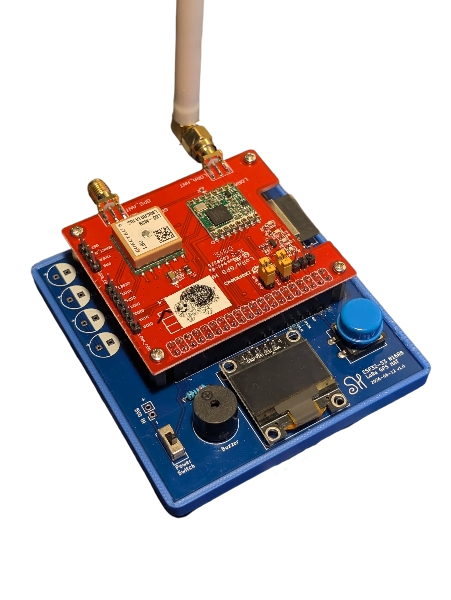
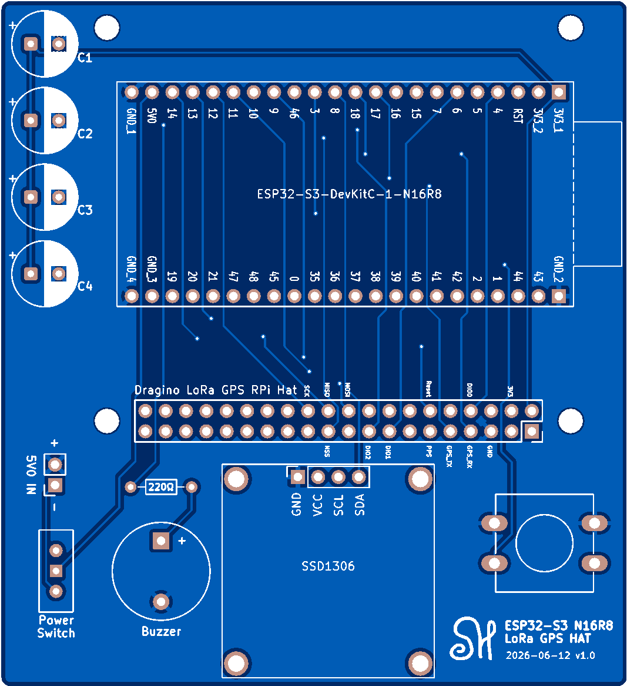
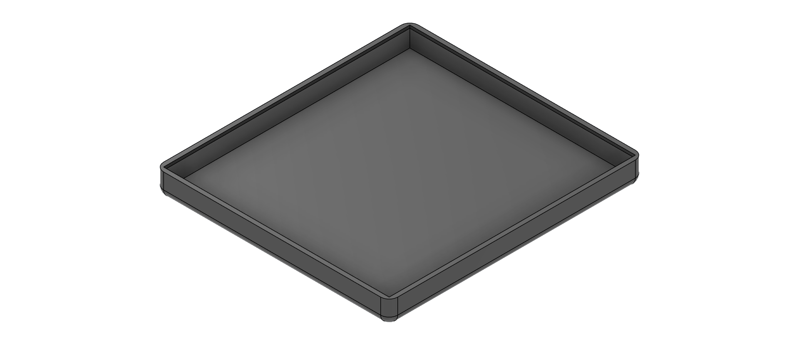

# Dragino LoRa RPi Hat ESP32 Retrofit

Custom [MeshCore](https://github.com/meshcore-dev/MeshCore) firmware and PCB carrier for running a **Dragino LoRa/GPS HAT** on an **ESP32-S3** instead of the Raspberry Pi it was designed for.

## What this actually is

The Dragino LoRa GPS HAT is built for the Raspberry Pi 40-pin GPIO header. It has no business working with an ESP32-S3 dev board. There's no official pinout for it, no example firmware, and none of the pin numbers on the HAT correspond to anything on an ESP32.

I designed a custom carrier PCB that reroutes the Dragino HAT's SPI, IRQ, and GPS UART lines to an ESP32-S3-DevKitC-1-N16R8, wrote a new MeshCore board target from scratch to drive that hardware, and got it running as three different mesh network node roles: a headless GPS repeater, a Bluetooth companion radio, and a USB-wired companion radio.

Everything here, the PCB, the case, and the firmware, was built to get an off-the-shelf Raspberry Pi accessory running on a completely different microcontroller architecture.

## The hardware

### Custom carrier PCB

The Dragino HAT header doesn't line up with anything on the ESP32-S3, so I designed a board in KiCad that:

- Breaks out both 24-pin rows of the ESP32-S3-DevKitC-1 header
- Routes SPI (SCK/MOSI/MISO), the three LoRa IRQ lines (DIO0/1/2), NSS, and RESET down to the Dragino HAT's Pi-header footprint in the correct positions
- Routes the GPS UART (TX/RX) and I2C (SDA/SCL) separately, since the L80 GPS module and the SSD1306 display need to share the board without colliding with the SPI bus
- Adds a 4-cell battery holder array, a power switch, a buzzer, and a footprint for the OLED and user button, so the whole companion radio build (display, button, buzzer, GPS, LoRa) lives on one board instead of a nest of jumper wires

### 3D-printed case

Modeled a low-profile tray enclosure to hold the stacked board assembly, sized to the footprint of the carrier PCB with room for the antenna connector and button access.

## What I actually had to figure out

This wasn't a drop-in board support file. Getting MeshCore to run correctly on this combination of parts meant working through a handful of problems that don't show up on boards MeshCore already supports:

**PSRAM pin conflicts.** The N16R8 variant of the ESP32-S3 uses GPIO 35, 36, and 37 internally for OPI PSRAM. Every wiring decision on the carrier board had to route around those three pins, since using them for anything else causes a silent crash on boot.

**No board definition existed for this chip variant.** PlatformIO's stock `esp32-s3-devkitc-1` board JSON doesn't know about the R8 OPI PSRAM, so the board fails with a PSRAM ID error before anything else runs. I wrote a custom `boards/dragino_esp32s3_n16r8.json` with `qio_opi` memory type set explicitly.

**Building a MeshCore target from nothing.** MeshCore expects a `target.h` / `target.cpp` / board class for every supported piece of hardware. There wasn't one for this pairing, so I wrote:
- `DraginoESP32S3Board.h`, a board class that reports the correct IRQ GPIO to the radio driver
- `target.h` / `target.cpp`, wiring up the SX1276 radio driver, the RTC clock with autodetect fallback, the GPS NMEA provider, and the SSD1306/button peripherals conditionally based on which node role is being built

**I2C had to be moved off the default pins by hand.** The ESP32 Arduino core defaults `Wire` to GPIO 21/22, which isn't where the SSD1306 is wired on this board. `Wire.begin(8, 9)` gets called explicitly in `radio_init()`, and the OLED's reset pin (default GPIO 21 in MeshCore) gets overridden to `-1` to avoid landing on the same pin as the display bus.

**Three node roles from one codebase, decided at compile time.** MeshCore can build as a repeater, a BLE companion radio, or (with a small addition I made to the variant's `platformio.ini`) a wired USB companion radio. The BLE-vs-USB choice comes down to whether `BLE_PIN_CODE` is defined at build time: if it is, `main.cpp` compiles in `SerialBLEInterface`; if it isn't, it falls through to plain `ArduinoSerialInterface` and the companion protocol runs over native USB serial instead. Same firmware logic, same wiring, different transport, chosen by which PlatformIO environment you flash.

## Node roles

| Role | Connectivity | Use case |
|---|---|---|
| **Repeater** | None (headless) | Deploy high, leave powered, extends mesh range, beacons GPS |
| **Companion Radio (BLE)** | Bluetooth to phone | Carry with you, OLED + button + buzzer, pairs with the MeshCore app |
| **Companion Radio (USB)** | Wired serial | Same features as BLE, plugs into a PC or SBC instead of pairing |

All three are built from the same variant and the same wiring; the only thing that changes is which PlatformIO environment gets flashed.

## Building it

Please see the [full guide](../../wiki/Building-It) in the wiki.

---

## Author

**Seth Hibpshman**  
Student of Electrical Engineering, Eastern Washington University

## AI Disclosure
_AI (LLM) tools were used for quality assurance review of the firmware and in the drafting and editing of this README and wiki documentation; all code was written by hand._

## License

[GNU General Public License v3.0](LICENSE)
